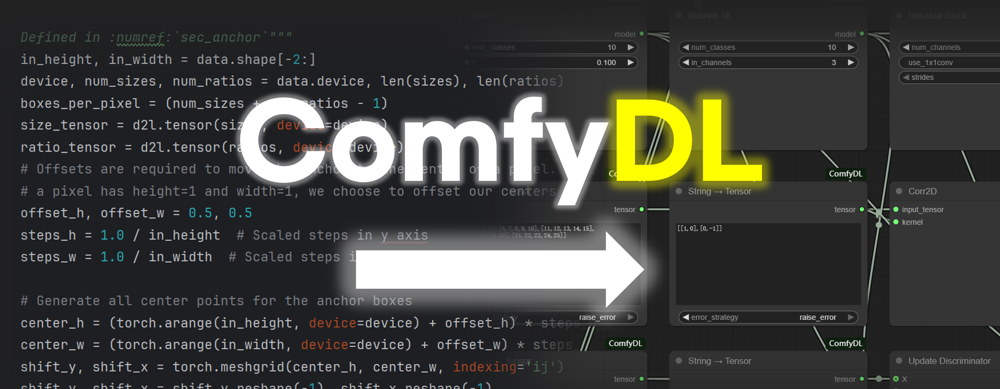
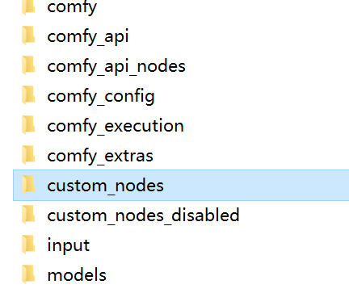

<div align="center">
<h1>ComfyDL</h1>
<p>DeepLearning is just a few clicks away!</p>
<p><sub>[中文版本 / Chinese](./README_zh.md)</sub></p>
</div>

---

## What's This?

**ComfyDL** lets you build deep learning workflows — from CNNs to BERT — by connecting nodes in ComfyUI, not by writing code. Powered by the `d2l` codebase, it's visual, educational, and great for rapid prototyping. Drag, connect, and see results instantly.

---

## Installation

> **This project requires ComfyUI.** If you don't have it, download from: [https://github.com/Comfy-Org/ComfyUI](https://github.com/Comfy-Org/ComfyUI)

1. Navigate to your `custom_nodes` folder:
   
   

2. Clone this repository:
   ```bash
   git clone https://github.com/Cynthia-lxx/ComfyDL ./ComfyDL
   ```
3. Install dependencies:
   ```bash
   pip install -r ./ComfyDL/requirements.txt
   ```
4. Restart ComfyUI. **You should see the new ComfyDL nodes appear in the node menu.**


---

## Function Overview

ComfyDL provides **71 nodes** across 10 categories:

| Category | Nodes | Examples |
|---|---|---|
| **CV Models** | 5 | LeNet, ResNet-18, ResNeXt block, 2D convolution |
| **NLP Utils** | 5 | Tokenization, vocabulary build/encode/decode |
| **Object Detection** | 10 | Box IOU / NMS, anchor generation, multibox target/detection |
| **Semantic Segmentation** | 4 | VOC colormap, label mapping, random crop |
| **Tensor Ops** | 17 | Linear regression, masked softmax, accuracy, BLEU, SGD, conv2d, transpose, activation |
| **Visualization** | 13 | Plot, charts (bar/pie/scatter/histogram/area), heatmaps, image grid, bounding boxes |
| **Datasets** | 10 | Fashion-MNIST, Bananas, VOC, download, DataLoader preview & stats |
| **GAN** | 2 | Discriminator / generator update steps |
| **Device Utils** | 3 | GPU info, try GPU(s) |
| **Misc** | 2 | Message box, no-op pass-through |

> For the complete node reference, see **[FUNCTIONS.md](./FUNCTIONS.md)** (English) or **[FUNCTIONS_zh.md](./FUNCTIONS_zh.md)** (中文).

---

## License

This project is licensed under the **MIT License** — see the [LICENSE](./LICENSE) file for details.

---

## Special Thanks

ComfyDL stands on the shoulders of the incredible **`d2l`** (Dive into Deep Learning) community.

- **Codebase:** We heavily reference and adapt implementations from the [`d2l-pytorch`](https://github.com/dsgiitr/d2l-pytorch) repository. Its clear, textbook-grade code serves as the backbone for many of our nodes. We are deeply grateful to all contributors who made this resource available under the permissive **MIT-0** license.
- **Inspiration:** The design and pedagogical philosophy behind this project are fundamentally inspired by the book **《Dive into Deep Learning》** (《动手学深度学习》PyTorch版), which offers one of the most accessible and practical paths to mastering deep learning.

This project would not exist without their vision and generosity. We encourage everyone to explore the original book and repository:

- **Book (Chinese):** https://zh.d2l.ai/
- **GitHub Repository:** https://github.com/dsgiitr/d2l-pytorch

---

