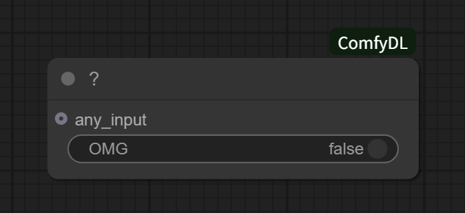

<div align="center">
<h1>ComfyDL</h1>
<p>深度学习，只需几次点击！</p>
  <a href="./README.md">English Version / 英文版</a>
</div>

---

## 这是什么？

**ComfyDL** 让你通过连接 ComfyUI 中的节点来构建深度学习工作流——从 CNN 到 BERT，以及更多——而无需编写代码。它深受 `d2l` 代码库启发，并持续自主开发更多有用的节点——可视化、富有教育意义，非常适合快速原型开发。拖拽、连接，即刻看到结果。

**ComfyDL 有自己的 GUI 版本：** [ComfyDL_UI](https://github.com/Cynthia-lxx/ComfyDL_UI) 把 ComfyDL 作为内置节点包注册在 ComfyUI 运行时分支之上——详见[安装](#安装)一节。

## 使用示例

> **说明：** ComfyDL 随附的示例工作流现已**归档**。它们早于正在进行的节点重构，与当前节点集不再匹配，
> 也不再作为工作流模板出现在界面中。它们保留在
> [`example_workflows/_archived/`](./example_workflows/_archived) 以备查阅；待重构完成后会发布一批新的可运行示例。

### 神秘的 "?"
一个带开关的小节点，会做点……什么。试一试就知道了~



---

## 安装

有两种方式可以运行 ComfyDL：使用 GUI 版本，或按经典方式手动装进已有的 ComfyUI。

### 方式一 —— GUI 版本：[ComfyDL_UI](https://github.com/Cynthia-lxx/ComfyDL_UI)

[ComfyDL_UI](https://github.com/Cynthia-lxx/ComfyDL_UI) 是 ComfyUI 的运行时分支，已把 ComfyDL
作为内置节点包注册好。不需要放进 `custom_nodes`，不需要单独安装依赖，也不需要手动接线，
只需要这个分支本身：

```bash
git clone https://github.com/Cynthia-lxx/ComfyDL_UI
cd ComfyDL_UI
penv\Scripts\python.exe main.py     # Windows
penv/bin/python main.py             # Linux / macOS
```

细节见其说明文档：<https://github.com/Cynthia-lxx/ComfyDL_UI#readme>。

### 方式二 —— 经典手动安装（装进已有的 ComfyUI）

> **此方式需要 ComfyUI。** 如果你还没有，请从以下地址下载：[https://github.com/Comfy-Org/ComfyUI](https://github.com/Comfy-Org/ComfyUI)

1. 进入你的 `custom_nodes` 文件夹：

   

2. 克隆本仓库：
   ```bash
   git clone https://github.com/Cynthia-lxx/ComfyDL ./ComfyDL
   ```
3. 安装依赖：
   ```bash
   pip install -r ./ComfyDL/requirements.txt
   ```
4. 重启 ComfyUI。**你应该能在节点菜单中看到 ComfyDL 新增的节点。**

---

## 功能概览

内置节点库共 **200 个节点**，涵盖 34 个类别 —— 其中 **109 个由 ComfyDL 提供**，
另加在其之上新增的 91 个 ComfyUI 核心节点（`Network & Layers` → `Activation` 14 个 + `Basic` 8 个
+ `Attention` 7 个 + `Normalization` 7 个 + `Regularization` 1 个 + `Training` 23 个 + `Pooling` 2 个 + `Convolution` 2 个 + `Text` 4 个；
`model` → `loaders` 7 个 + `merging` 11 个 + `latent` 2 个 + `conditioning` 2 个；
`3d` → `Preview 3D` 1 个）：

| 类别 | 节点数 | 说明 |
|---|---|---|
| **CV 模型** | 5 | CNN 基础与模型构建 |
| **数据集** | 10 | 数据集下载、加载、预览与统计 |
| **设备工具** | 3 | GPU/CPU 设备查询 |
| **GAN** | 2 | GAN 训练更新 |
| **模型工具** | 7 | 模型信息、模式、前向、层结构、参数、克隆与存取 |
| **NLP 模型** | 12 | RNN/GRU/RNNLM、注意力与 Seq2Seq 构件 |
| **NLP 工具** | 5 | 文本分词与词表 |
| **目标检测** | 10 | 锚框、IoU、NMS |
| **语义分割** | 4 | VOC 语义分割工具 |
| **张量基础** | 5 | 张量 I/O、卷积、转置、广播、激活函数 |
| **张量运算** | 10 | 损失、优化、评估指标 |
| **可视化** | 13 | 图表与边界框可视化 |
| **已弃用 · 模型工具** | 1 | 已弃用（软归档）：Model Mode，纯 TENSOR 图改用核心 Training Mode |
| **已弃用 · NLP 模型** | 4 | 已弃用（软归档）：Multi-Head Attention、Add & Norm、Transformer Encoder Block/Encoder |
| **已弃用 · 张量基础** | 3 | 已弃用（软归档）：Broadcast、Reshape、Activation |
| **Comfy 图像** | 1 | 图像批次逐通道统计 |
| **Comfy 图像/颜色** | 3 | 灰度、归一化与亮度/对比度/饱和度 |
| **Comfy 图像/变换** | 1 | 任意角度旋转 + 画布扩展 |
| **Comfy 实用工具** | 4 | MessageBox、NoOp 空操作与基准计时 |
| **conversion** | 6 |  |

> 上表 20 个类别是 ComfyDL 自身提供的部分；随宿主发布的节点库另外 13 个类别（`Network & Layers/*`、
> `model/*` 与 `3d` 三条分支，共 91 个节点）是纯 ComfyUI 核心分类。
>
> 完整节点参考，请参阅 **[FUNCTIONS.md](./FUNCTIONS.md)**（英文）或 **[FUNCTIONS_zh.md](./FUNCTIONS_zh.md)**（中文）。

---

## 仓库结构

```
ComfyDL/
├── src/d2lcore/     # 受 D2L 启发的核心实现——参考层（torch.py 等）
├── nodes/           # ComfyUI 节点定义（薄映射层）
│                    #   含自主开发的 model_utils.py、image_tools.py 及
│                    #   NLP 模型包装（model_nlp.py、model_attention.py、model_seq2seq.py）
└── example_workflows/  # 已归档的示例工作流 JSON（见 _archived/，不再作为模板提供）
```

> **注意：** `src/d2lcore/` 的镜像副本同时存在于仓库根目录的 `d2lcore/`（插件目录之外）。修改 D2L 核心逻辑时两处需保持同步。

---

## 许可证

本项目基于 **GNU 通用公共许可证第 3 版**（或更高版本）授权——详见 [LICENSE](./LICENSE) 文件。
ComfyDL 作为 [ComfyDL_UI](https://github.com/Cynthia-lxx/ComfyDL_UI) 项目的节点包分发，采用同一
许可证；上游 ComfyUI 保留其自身版权与维护者。

---

## 特别鸣谢

ComfyDL 站在卓越的 **`d2l`**（动手学深度学习）社区的肩膀之上。

- **代码库：** 我们大量参考并借鉴了 [`d2l-pytorch`](https://github.com/dsgiitr/d2l-pytorch) 仓库的实现。其清晰、教科书级别的代码是许多节点的优质参考与起点，并将继续指引新节点的开发。我们深深感谢所有在宽松的 **MIT-0** 许可证下贡献这一资源的开发者们。
- **灵感来源：** 本项目从设计到教学理念，都深受 **《动手学深度学习》**（PyTorch 版）一书的启发，它为掌握深度学习提供了最易于理解且实用的路径之一。

没有他们的远见与慷慨，就不会有本项目。我们鼓励大家去探索原书和仓库：

- **书籍（中文）：** https://zh.d2l.ai/
- **GitHub 仓库：** https://github.com/dsgiitr/d2l-pytorch

---

> **免责声明：** 本文档由 AI 翻译自英文原版 [README.md](./README.md)，可能存在不准确之处。如有歧义，请以英文原版为准。


